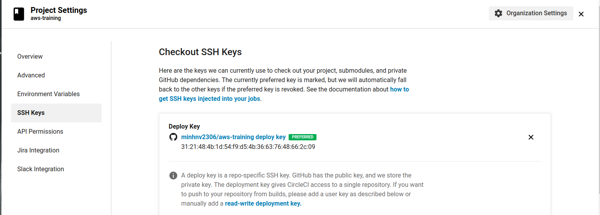

Việc kiểm tra các vấn đề liên quan đến convention, unit test trong project của bạn là thực sự cần thiết. Bạn cần đảm bảo rằng, mọi commit từ các thành viên trong team của bạn vượt qua **tất cả** các test này để không gây ra các bug "khó đỡ". Và sau khi các commit này đã thỏa mãn các điều kiện, bạn sẽ deploy các commit này lên các host, đưa đến những chức năng trải nghiệm mới cho người dùng.

Các thao tác thủ công khi thực hiện kiểm tra này và quá trình deploy mất thời gian, và hoàn toàn có thể sử dụng các tool CI/CD để thực hiện tự động. Trong phạm vi bài viết, tôi sẽ hướng dẫn các bạn sử dụng CircleCI để làm các công việc này một cách tự động, kiểm tra convention (phpcs) và unit test (phpunit) toàn bộ commit từ các nhánh khác nhau của các thành viên trong team, sau đó sẽ tự động deploy nếu thoả mãn các test và sẽ gửi kết quả này qua Chatwork.

Tôi sẽ sử dụng project PHP với framework **Laravel**, **Deployer Tool** để làm ví dụ.
# Điều kiện tiên quyết
Trước khi bắt đầu, bạn sẽ cần:
- Bạn đã có một ứng dụng Laravel, có các unit test và config phpcs cho mã nguồn của bạn. Bên cạnh đó bạn cũng cần một host phục vụ cho việc deploy.
- Bạn đã biết [cách tích hợp "Hello World" CircleCI cho một ứng dụng](https://circleci.com/docs/2.0/getting-started/).
- Đã biết sử dụng cơ bản **Deployer Tool** để deploy ứng dụng.

Sau khi đã có đầy đủ điều kiện trên, hãy bắt đầu cùng triển khai các jobs, steps, workflows để ứng dụng của bạn tự động kiểm tra các test và tự động deploy với CircleCI nào!!
# Khởi động
Chúng ta sẽ bắt đầu từ việc tích hợp đơn giản nhất, "Hello World" cho project của bạn. Đây sẽ là file cấu hình CircleCI:
```
├── .circleci
│   ├── config.yml
├── README
└── all-other-project-files-and-folders
```
File `config.yml` đơn giản chỉ là "Hello World":
```yaml
version: 2
jobs:
  build:
    docker:
      - image: circleci/ruby:2.4.1
    steps:
      - checkout
      - run: echo "A first hello"
```

# Tích hợp CI
Trong phạm vi bài viết tôi sẽ hướng dẫn cơ bản check convention theo chuẩn **Framgia** và tiến hành check thêm unit test. Như vậy, sẽ không có một commit nào vi phạm 2 điều kiện trên sẽ được merge vào nhánh `develop`.

### Thay đổi base image
Đầu tiên là ta phải đổi base image, không sử dụng ruby nữa.
```yaml
version: 2.1
jobs:
  build_and_test:
    docker:
      # Specify the version you desire here
      - image: circleci/php:7.2-browsers
```

### Định nghĩa steps
Các steps của job `build_and_test` cần thực hiện các cài đặt cần thiết và kiểm tra `phpcs`, `phpunit`. Chúng ta cần thực hiện:
- Cài đặt thêm `phpcs` và download thêm Standards Framgia. Cách cài đặt bạn có thể tham khảo tại [đây](https://github.com/squizlabs/PHP_CodeSniffer)
```bash
composer global require "squizlabs/php_codesniffer=*"
git clone https://github.com/wataridori/framgia-php-codesniffer.git ~/.composer/vendor/squizlabs/php_codesniffer/src/Standards/Framgia
```
> Bạn hoàn toàn có thể có một cách khác là thay đổi base image `circleci/php:7.2-browsers` tới image của bạn, đã cài đặt PHPCS và clone Starndards Framgia. Không vấn đề.

- PHPUnit đã được require trong code của bạn, do đó không cần require thêm, chỉ cần cài đặt các dependencies là được
```bash
composer install
```
Đặt chúng lại với nhau, ta sẽ được file config như sau:
```yaml
version: 2.1
 jobs:
   build_and_test:
     docker:
      # Specify the version you desire here
       - image: circleci/php:7.2-browsers
    steps:
      - checkout

      - run:
          name: "Prepare Environment"
          command: |
            sudo apt update
            sudo docker-php-ext-install zip
            composer global require "squizlabs/php_codesniffer=*"
            git clone https://github.com/wataridori/framgia-php-codesniffer.git ~/.composer/vendor/squizlabs/php_codesniffer/src/Standards/Framgia

      # Download dependencies
      - run:
          name: "Install Dependencies"
          command: composer install -n --prefer-dist

      # Run tests with phpunit
      - run:
          name: "Run PHPUnit Tests"
          command: ./vendor/bin/phpunit

      # Run phpcs tests!
      - run:
          name: "Run PHPPCS Tests"
          command: sudo ~/.composer/vendor/bin/phpcs
workflows:
  version: 2
  build_and_deploy:
    jobs:
      - build_and_test
```
Trong các step trên, chúng ta cần thêm lệnh `sudo docker-php-ext-install zip` để cài thêm zip extension, để có thể download và giải nén Starndards Framgia từ git. Nhìn chung lại file cấu hình cũng khá đơn giản.
## Caching
Trong bài viết về cache, tôi đã đề cập tới việc CircleCI có hỗ trợ bạn cache liên quan đến việc cài đặt các dependencies và chúng ta cần thực hiện chúng thủ công, bạn nhớ chứ? Chúng ta hoàn toàn có thể áp dụng ở đây trước khi chạy các tests:
```yaml
# Download and cache dependencies
- restore_cache:
  keys:
    # "composer.lock" can be used if it is committed to the repo
    - v1-dependencies-{{ checksum "composer.json" }}
    # fallback to using the latest cache if no exact match is found
    - v1-dependencies-
- run:
  name: "Install Dependencies"
  command: composer install -n --prefer-dist

- save_cache:
  key: v1-dependencies-{{ checksum "composer.json" }}
  paths:
    - ./vendor
```
Ở đây tôi sẽ sử dụng cahe, check sự trùng khớp chính xác đầu tiên `v1-dependencies-{{ checksum "composer.json" }}` và sau đó sẽ sử dụng cache một phần từ mọi nhánh và mọi reversion của ứng dụng `- v1-dependencies-`

Và đây là kết quả khi bạn đạt được:


# Tích hợp CD
## Trước khi bắt đầu
- **SSH Key**: Để tích hợp quá trình tự động deploy, yêu cầu cơ bản nhất là bạn cần có quyền ssh đến host. CircleCI hỗ trợ bạn thêm SSH key ngay trên ứng dụng. Bạn có thể xem tại [đây](https://circleci.com/docs/2.0/add-ssh-key/). Các ssh của bạn được thiết lập trong **Project Setting**, chọn **SSH Key**

- Như tôi đã nói ở phần Điều kiện tiên quyết, ứng dụng của bạn đã config để có thể deploy với Deployer Tool. Bạn hãy kiểm tra để chắn nó thành công bằng lệnh deploy:
```bash
dep deploy
```
Nếu hai điều kện trên của bạn đã đáp ứng, còn chần chừ gì nữa, tích hợp vào CircleCI thôi

## Tích hợp với CircleCI
Chúng ta sẽ định nghĩa một job mới cho việc deploy. Trong bước tích hợp SSH Key ở trên, CirlceCI sẽ trả về cho bạn một fingerprints của SSH Key. Fingerprints này chính là id của rsa key, để circleCI biết sử dụng key nào để connect đến server của bạn. Ví dụ như fingerprints trả về cho bạn là `SO:ME:FIN:G:ER:PR:IN:T` thì trong thư mục `~/.ssh` trên CirlceCI sẽ có 1 khóa tương ứng `id_rsa_SO_ME_FIN_G_ER_PR_IN_T`. Nhưng như vậy thì bạn phải nói cho CircleCI biết fingerprints này để CircleCI biết sử dụng khóa nào đúng không? Để làm như vậy, bạn sử dụng:
```yaml
- add_ssh_keys:
      fingerprints:
        - "SO:ME:FIN:G:ER:PR:IN:T"
```
Khi đã có key, công việc tiếp theo của bạn là cài đặt Deployer Tool vào container trên Circle
```yaml
- run:
  name: Install Deployer
  command: |
    curl -LO https://deployer.org/deployer.phar
    sudo mv deployer.phar /usr/local/bin/dep
    sudo chmod +x /usr/local/bin/dep
```
Một chú ý là khi bạn kết nối ssh đến host, nó yêu cầu sự tương tác của bạn nhận biết các Host Key (trong file `~/.ssh/known_hosts)` một cách thủ công và bạn cần xác nhận "Yes" để tiếp tục kết nối. Do đó để không phải làm việc này, bạn cần thêm host của bạn vào file này luôn.
```bash
if [ -z `ssh-keygen -F '52.15.170.75'` ]; then
  ssh-keyscan -H '52.15.170.75' >> ~/.ssh/known_hosts
fi
```
Sau đó tiền hành deploy với `dep deploy` mà không hề gặp vấn đề gì.

Tóm lại phần deploy của bạn sẽ như sau
```yaml
deployment:
docker:
  - image: circleci/php:7.2-browsers
steps:
  - add_ssh_keys:
      fingerprints:
        - "59:43:6e:72:dc:75:53:ab:f3:e7:33:2a:05:98:46:a0"
  - checkout
  - run:
      name: Install Deployer
      command: |
        curl -LO https://deployer.org/deployer.phar
        sudo mv deployer.phar /usr/local/bin/dep
        sudo chmod +x /usr/local/bin/dep
  - run:
      name: Deploy project via Deployer Tool
      command: |
        if [ -z `ssh-keygen -F '52.15.170.75'` ]; then
          ssh-keyscan -H '52.15.170.75' >> ~/.ssh/known_hosts
        fi

        dep deploy
```
> Cũng tương tự như tích hợp PHPCS, bạn cũng có thể sử dụng image của bạn đã cài đặt Deployer để bỏ qua bước "Install Deployer".

# Thông báo kết quả build qua ChatWork
Bạn không muốn mỗi lần build một jobs, bạn lại phải vào ứng dụng CircleCI để xem kết quả hoặc đơn giản bạn muốn có một con BOT thông báo kết quả build này tới toàn bộ thành viên trong team bạn, những người có thể không vào được CircleCI của dự án. Mặc định, CircleCI đã tích hợp thông báo kết quả qua Slack, tuy nhiên trong phạm vi bài viết và cũng để phục vụ cho công việc chung của chúng ta, tôi sẽ hướng dẫn thông báo kết quả qua Chatwork.

Chức năng nghe có vẻ to tát, thực chất nó chỉ là một lời gọi đến [Chatwork API](https://download.chatwork.com/ChatWork_API_Documentation.pdf). Bạn hoàn toàn có thể test thủ công khi đã có Token của ChatBot gửi tin nhắn, và room_id của phòng nhận tin nhắn:
```bash
curl -X POST -H "X-ChatWorkToken: CHATWORK_TOKEN" -d \
  "body=[To:3008547] [info][title]Circle CI Build Result 1102 - SUCCESS[/title]Repo: devops-group7pro
Author: devops-team
Branch: develops
Build link: https://app.circleci.com/pipelines/github/minhnv2306/devops/1 [/info]" \
"https://api.chatwork.com/v2/rooms/CHATWORK_ROOM_ID/messages"
```
Và kết quả thành công sẽ trả về cho bạn message_id
```
{"message_id":"1346155088925687808"}
```

## Tích hợp vào CircleCI
Ta sẽ gửi thông báo đến cho mọi người bất kể job lỗi hay thành công, để làm việc này, ta cần bắt cả 2 trường hợp dựa vào tùy chọn `when` của job này
```bash
# Sending Chatwork Notification
- run:
  name: "Sending Chatwork Notification"
  when: on_success
  command: |
    curl -X POST -H "X-ChatWorkToken: chatwork_token" -d \
      "body=[To:3008547] [info][title]Circle CI Build Result $CIRCLE_BUILD_NUM - SUCCESS[/title]Repo: $CIRCLE_PROJECT_REPONAME
    Author: $CIRCLE_USERNAME
    Branch: $CIRCLE_BRANCH
    Build link: https://app.circleci.com/pipelines/github/minhnv2306/aws-training/$CIRCLE_BUILD_NUM [/info]" \
    "https://api.chatwork.com/v2/rooms/room_id/messages"
# Sending Chatwork Notification
- run:
  name: "Sending Chatwork Notification"
  when: on_fail
  command: |
    curl -X POST -H "X-ChatWorkToken: $CHATWORK_TOKEN" -d \
      "body=[To:3008547] [info][title]Circle CI Build Result chatwork_token - FAIL[/title]Repo: $CIRCLE_PROJECT_REPONAME
    Author: $CIRCLE_USERNAME
    Branch: $CIRCLE_BRANCH
    Build link: https://app.circleci.com/pipelines/github/minhnv2306/aws-training/$CIRCLE_BUILD_NUM [/info]" \
    "https://api.chatwork.com/v2/rooms/room_id/messages"
```
> Khoan đã, có cái gì đó không ổn. Giá trị chatwork_token và room_id bạn đang để vào trong file config và đẩy lên github và ai cũng có thể thấy nó. 

Đối với các giá trị nhạy cảm, theo một [best practice](https://circleci.com/blog/six-optimization-tips-for-your-config/) bạn sẽ không để trực tiếp vào file config. CircleCi cung cấp cho bạn biến [Environment Variables](https://circleci.com/docs/2.0/env-vars/#setting-an-environment-variable-in-a-project) để lưu trữ các giá trị này. Và đoạn `curl` sẽ sửa thành load các biến trong env như sau:
```bash
curl -X POST -H "X-ChatWorkToken: $CHATWORK_TOKEN" -d \
  "body=[To:3008547] [info][title]Circle CI Build Result $CIRCLE_BUILD_NUM - SUCCESS[/title]Repo: $CIRCLE_PROJECT_REPONAME
Author: $CIRCLE_USERNAME
Branch: $CIRCLE_BRANCH
Build link: https://app.circleci.com/pipelines/github/minhnv2306/aws-training/$CIRCLE_BUILD_NUM [/info]" \
"https://api.chatwork.com/v2/rooms/$CHATWORK_ROOM_ID/messages"
```
Ngon rồi!

# Build job kèm điều kiện
Chúng ta đã config tích hợp xong CI/CD cho ứng dụng. Tuy nhiên chúng ta chưa thiết lập thứ tự chạy các jobs này. Job `deployment` không thể chạy trước `build_and_test` và cũng không thể chạy song song.

Về cơ bản chúng ta sẽ build các job này với điều kiện sau:
- `build_and_test`: chạy cho mọi commit, pull request vào project.
- `deployment`:
    - chỉ chạy trên nhánh `develop`
    - chỉ chạy khi  build_and_test thành công (các commit đã vượt qua tất cả các tests).

Như vậy file config sẽ như sau:
```yaml
workflows:
  build_and_deploy:
    jobs:
      - build_and_test
      - deployment:
          requires:
            - build_and_test
          filters:
            branches:
              only: develop
```
Các điều kiện filter, thứ tự bạn có thể tham khảo tại [đây](https://circleci.com/docs/2.0/configuration-reference/#workflows)

# Tổng kết
- Mọi thao tác tự động được tích hợp vào CircleCI đều cần thực hiện thủ công thành công trước.
- Việc quản lý SSH Key và Các biến môi trường được CircleCI setting trong tùy chọn Project Setting.
- Project demo bạn có thể tham khảo tại [đây](https://github.com/minhnv2306/aws-training/blob/master/.circleci/config.yml)

# References
- [CI/CD cùng CircleCI và Deployer cho dự án Laravel - Viblo](https://viblo.asia/p/devops-cicd-cung-circleci-va-deployer-cho-du-an-laravel-gDVK2mGn5Lj)
- [Build a CI powered RESTful API with Laravel](https://circleci.com/blog/build-a-ci-powered-restful-api-with-laravel/)
